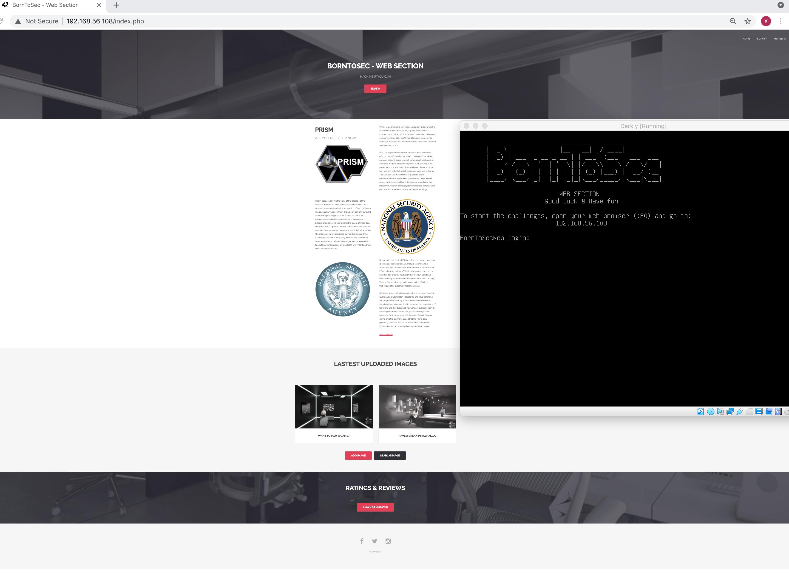
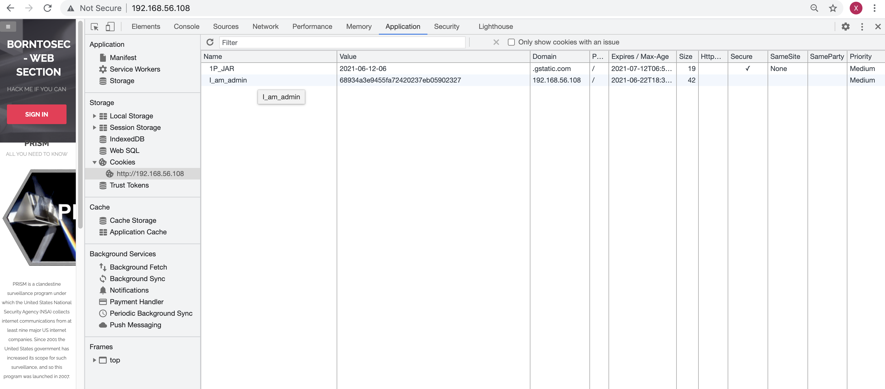
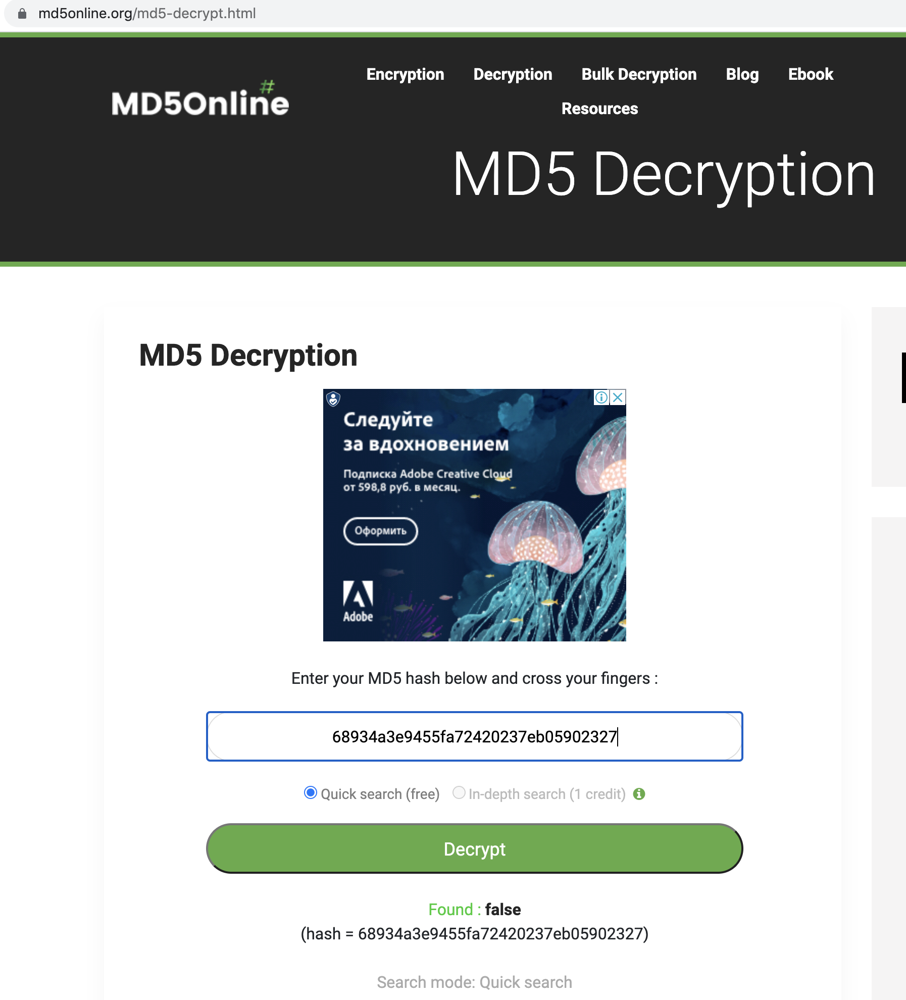
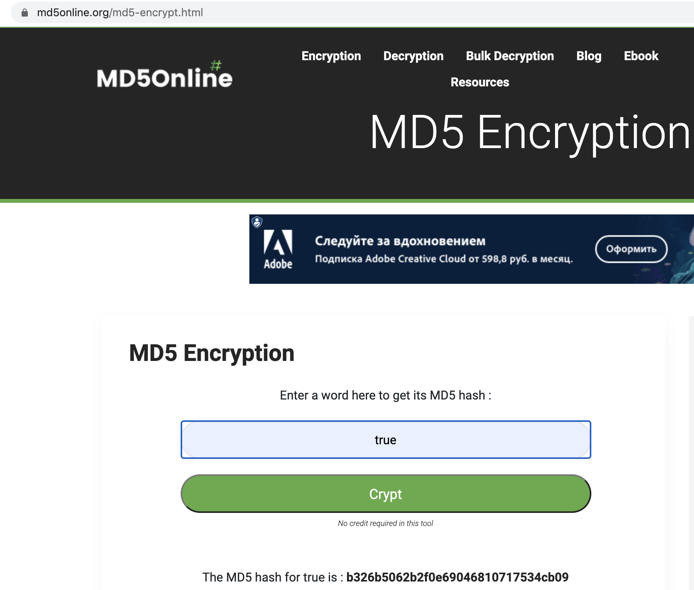
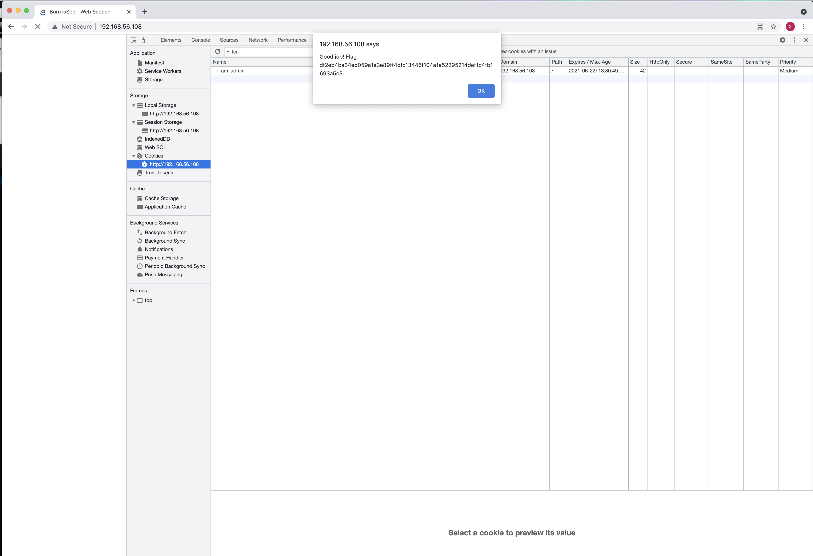

Уязвимость

Мы открываем сайт по IP http://192.168.56.108/index.php
 

Когда мы проверяем файлы cookie, мы видим куки I_am_admin со значением 68934a3e9455fa72420237eb05902327 который, кажется, определяет, есть ли у пользователя права администратора.
 
Это уязвимость с высоким риском, потому что файл cookie никогда не должен использоваться сервером в качестве фактора уверенности, 
всегда следует проводить проверку, поскольку он может быть изменен. Файл cookie предназначен только для хранения информации за определенный период на стороне клиента и передачи ее в необходимых запросах.

Значение cookie - это хэш MD5 (68934a3e9455fa72420237eb05902327), который равен false  .

Нам просто нужно закодировать true в MD5 (b326b5062b2f0e69046810717534cb09)
 
 и заменить значение cookie, чтобы получить доступ администратора.

При обновлении страницы мы получаем флаг.
 

# Как это предотвратить? Возможные исправления

* Чтобы проверить роли пользователя на веб-сайте, хорошим решением будет использование веб-токенов JSON. Маркер генерируется и подписывается сервером после аутентификации пользователя и отправляется клиенту. После этого токен отправляется обратно на сервер с каждым запросом, требующим определенных прав, и сервер проверяет, действителен ли он (он не был изменен или срок его действия не истек) перед отправкой ответа.

* MD5 имеет слабый алгоритм, поэтому  используйте например более сложный алгоритм симметричного кодирования, например как AES-256 с секретным ключом, хранящимся на стороне сервера.

* Было бы хорошо хранить случайный уникальный хэш в файлах cookie вместо учетных данных или логических значений, который генерируется случайным образом при каждом входе в систему и сохраняется (или обновляется) в базе данных.

* Этот файл cookie мог использовать флаги http-only и secure.

* Лучшим вариантом могло быть создание сеанса на стороне сервера.